# Hi 👋, I'm Raunak Sarkar

<div align="center">

# 🚀 Full Stack Developer | Problem Solver | Designer | Competitive Coder


</div>

---

## 🌍 About Me

- 🎓 B.Tech in Information Technology
- 💻 Full Stack Developer (MERN)
- 🏆 Competitive Programmer
- 🌱 Exploring AI, System Design and Modern Web Technologies
- 🎨 Graphic Design & Branding Enthusiast
- ⚡ Building impactful products and solving real-world problems

---

## 🛠️ Tech Stack

### Languages


### Frontend & Backend


### Tools


---

## 🏆 Achievements

- ⭐ 3 Star CodeChef Programmer
- ⭐ 5 Star HackerRank (C & C++)
- 🏅 GoDaddy Registry Award Recipient
- 🌍 Open Source Contributor

---

## 📊 GitHub Analytics

<p align="center">


</p>

<p align="center">

</p>

---
 

```yaml
name: Metrics

on:
  schedule:
    - cron: "0 0 * * *"
  workflow_dispatch:

jobs:
  github-metrics:
    runs-on: ubuntu-latest
    steps:
      - uses: lowlighter/metrics@latest
        with:
          user: YOUR_USERNAME
          template: classic
          base: header, activity, community, repositories
          plugin_isocalendar: yes
          plugin_languages: yes
          plugin_stars: yes
          plugin_followup: yes
          plugin_lines: yes
          plugin_topics: yes
          plugin_worldmap: yes
```

# 🌎 GitHub Metrics



---

# 🐍 Contribution Snake


---

## 🤝 Connect With Me

[]([(https://www.linkedin.com/in/raunak-sarkar-424a4425b/)])

---

<div align="center">

### ⭐ If you like my work, consider following me!

</div>
